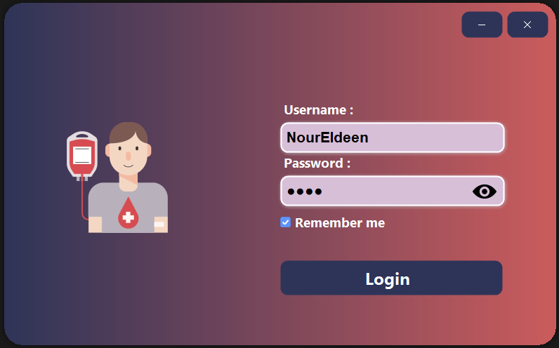
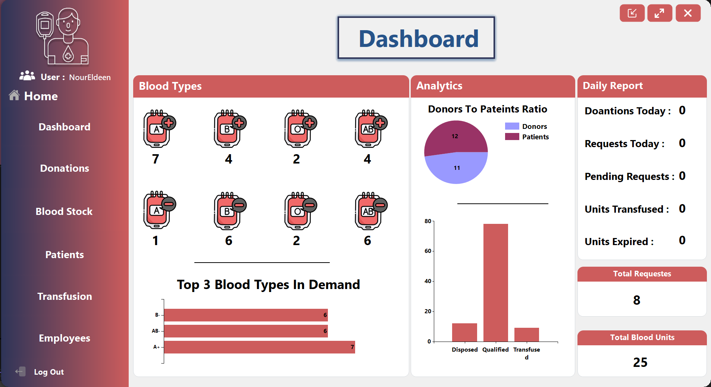
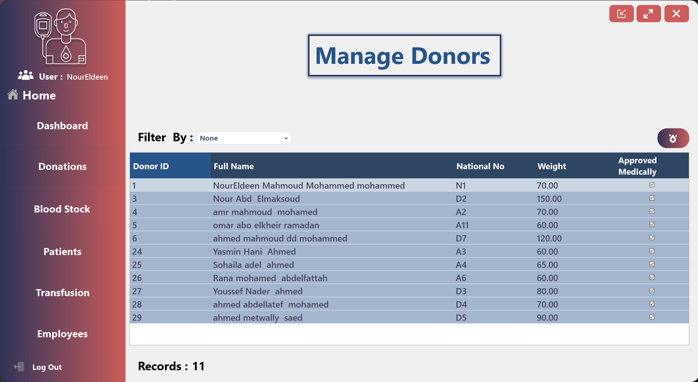
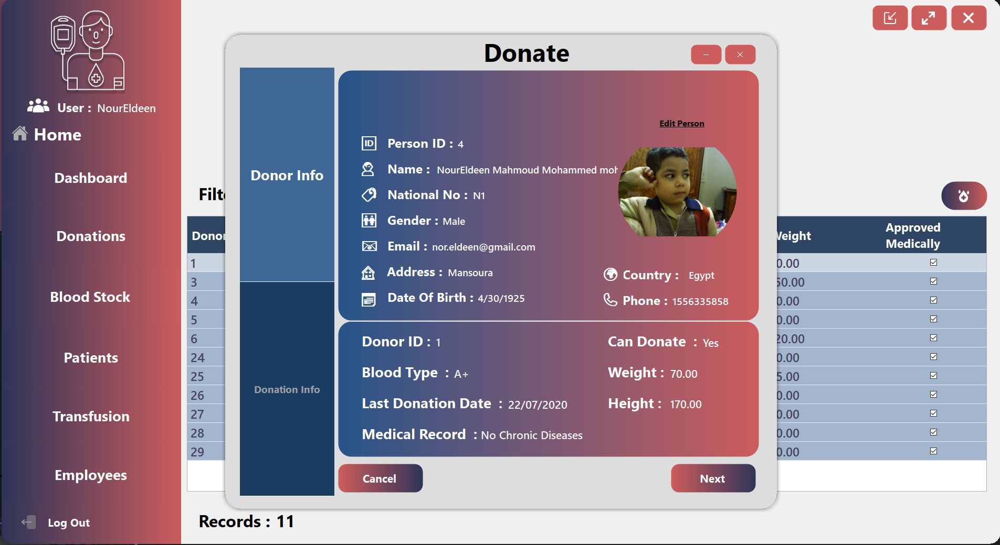
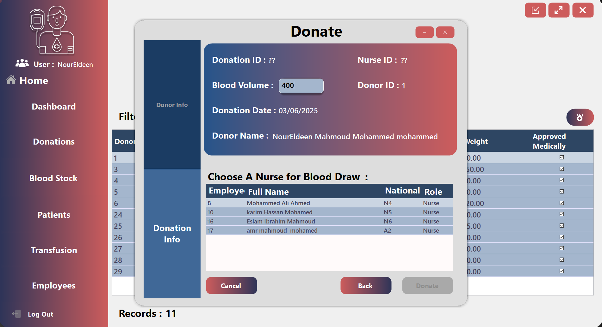
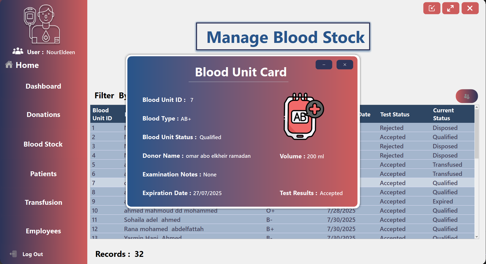
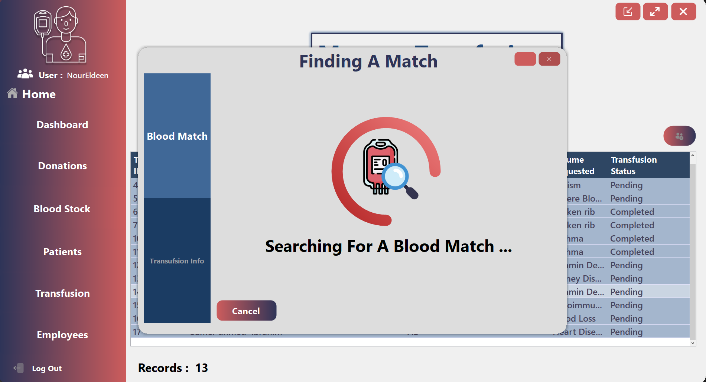
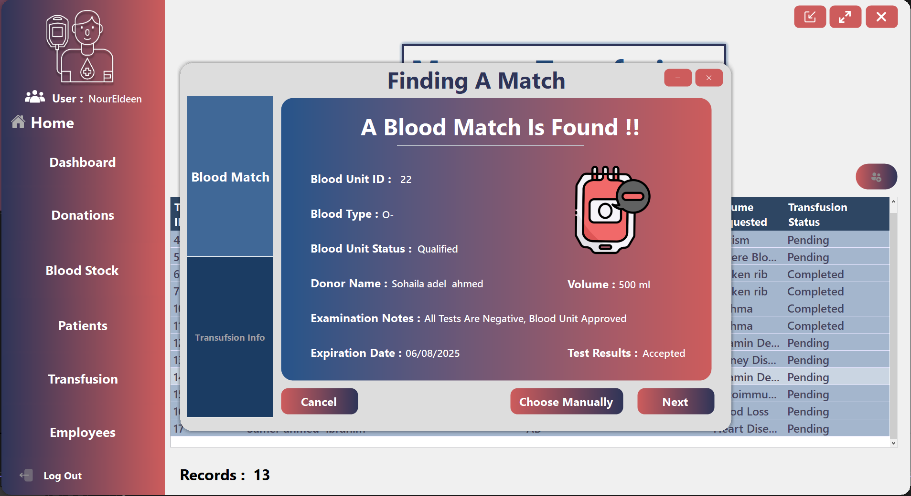

# Blood Bank Management System (BBMS)

A comprehensive Windows desktop application for managing blood bank operations, including donations, inventory, transfusions, and patient management.

## 📋 Overview

The Blood Bank Management System (BBMS) is a multi-tier application designed to streamline blood bank operations. The system provides a complete solution for blood donation centers to manage donors, blood inventory, patients, transfusion requests, and employee access controls.

## 🚀 Features

- **Dashboard:** Real-time analytics with blood type availability, most requested blood types, donor-to-patient ratios, and daily operational metrics.
- **Donor Management:** Register new donors, track donation history, and manage donor information.
- **Blood Stock Management:** Track blood units, manage expiration dates, and record test results.
- **Patient Management:** Register patients, manage patient records, and track medical history.
- **Transfusion Management:** Process transfusion requests, track transfusion history, and manage blood unit allocation.
- **Employee Management:** Manage staff accounts with role-based access control.
- **Reporting:** Generate reports on inventory, donations, and transfusions.

## 🖥️ User Interface

The application features a modern and intuitive user interface built with Guna UI Framework for Windows Forms, providing:

- Responsive dashboard with data visualization
- Card-based design for donor, patient, and blood unit information
- Intuitive navigation with a sidebar menu
- Form-based data entry with validation
- Search and filter functionality for easy data retrieval

## 🏗️ Architecture

The BBMS follows a three-tier architecture:

1. **Presentation Layer (BBMS):** Windows Forms UI components
2. **Business Layer (BBMS-Business):** Business logic and validation
3. **Data Access Layer (BBMS-Data):** Database operations and data access

## 🛠️ Technologies

- **Framework:** .NET Framework 4.7.2
- **UI Framework:** Guna UI2 for Windows Forms
- **Database:** Microsoft SQL Server
- **Data Visualization:** Windows Forms Chart Controls
- **Design Pattern:** Three-tier architecture with Data Access Layer (DAL)

## 📊 Blood Management Features

- Blood type compatibility checking
- Automatic expired blood unit detection
- Blood testing and quality assurance
- Blood unit tracking from donation to transfusion or disposal
- Inventory management with alerts for low stock levels

## 🔐 Security Features

- Role-based access control
- Secure user authentication
- Data validation and sanitization
- Audit logging for critical operations

## 📸 Screenshots

### Login Screen

### Dashboard

### Donor Management

### Donation Process

### Blood Unit Card

### Blood Matching

## 🚀 Getting Started

### Prerequisites
- Windows 7 or later
- .NET Framework 4.7.2 or later
- Microsoft SQL Server 2014 or later

### Installation
1. Clone the repository
2. Open the solution in Visual Studio
3. Build the solution to restore NuGet packages
4. Configure the database connection string in `BBMS-Data/clsDataAccessSettings.cs`
5. Run the application

## 👨‍💻 Our Team

### Development Team
- **[NourEldeenMahmoud](https://github.com/NourEldeenMahmoud)** 
- **[OmarAbouelkheirr](https://github.com/OmarAbouelkheirr)** 

## 👥 Acknowledgements

- [Guna UI](https://gunaui.com/) - Modern UI components
- [Flaticon](https://www.flaticon.com/) - Icons used in the application 
